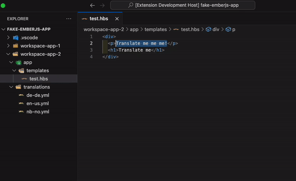

# Ember Intl Tools for Visual Studio Code

Tired of manually adding translations? Me too... Ember Intl Tools is an extension that enhances your development workflow when working with Ember.js internationalization (i18n) in Visual Studio Code.

## Features

- **Adding Translations**: Quickly add translations thoughout locales and auto insert handlebars markup.
- **Inserting Handlebar Translations**: Streamline the process of inserting handlebar translations.
- **Looking Up Translations**: Efficiently find translations, both with commands and inline in handlebars.
- **Copying Translations**: Conveniently copy translations, also from inline handlebars.

## Configuration

It is recommended to run the command `Intl Tools: Quick Configuration` for first time setup.

You can also configure the extension by pressing <kbd>Cmd</kbd> + <kbd>,</kbd> or <kbd>Ctrl</kbd> + <kbd>,</kbd> and search for `Ember-intl-tools`.

### Settings

#### Add Translation To All Files (Default: false)

- When enabled, the extension scans for all available locales in the '/translations' directory and applies the specified translation to each of them. Please note that it does not perform the translation for you.

#### Set Default Locale File (Default: no-nb.yml)

- Set the default locale file to which translations will be added. The default is "no-nb.yml."

## Limitations

Please be aware of the following limitation:

- The extension does not support lookups on translations within constructs like `{{t "qrscanner.error" error=this.error}}`.
